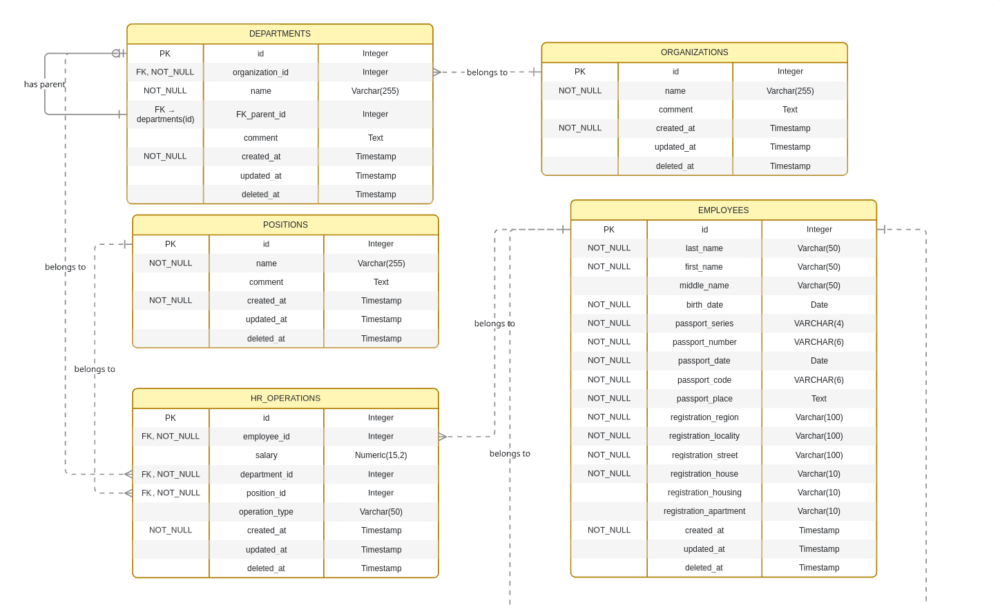
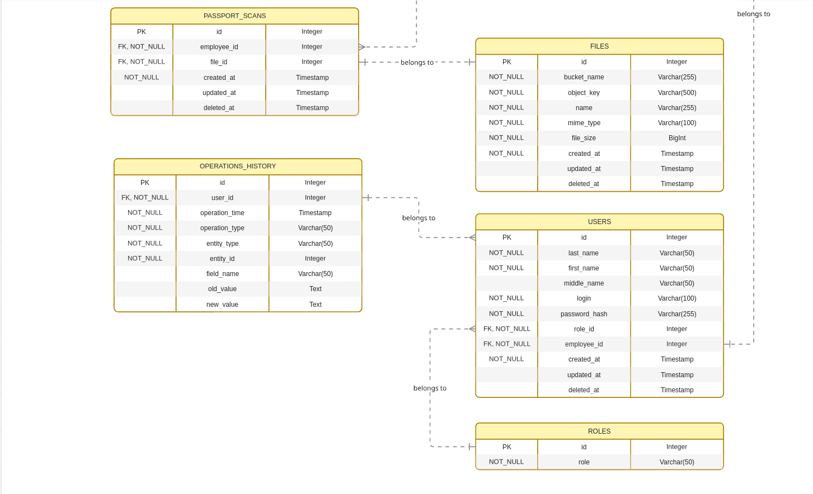
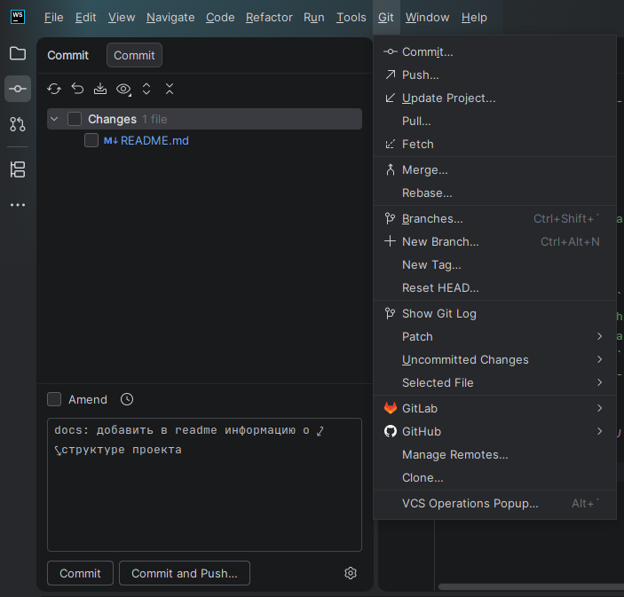

# Веб-приложение "Учёт сотрудников"
## Описание
Задание для образовательного проекта компании "Ареал". Веб-приложение, в котором специалист по кадрам ведет учет сотрудников в нескольких организациях.

## Структура проекта
```plantuml
areal-hr_ext-test/
├── /api/................................
│   ├── /node_modules/...................
│   ├── /migrations/.....................
├── /app/................................
│   ├── /node_modules/...................
├── /containers/.........................
│   ├── /api/............................
│   │   ├── Dockerfile...................
│   ├── /app/............................
│   │   ├── Dockerfile...................
├── /docs/...............................
├── /.gitignore..........................
├── /.env................................
├── /.env.example........................
├── /docker-compose.yml..................
├── /README.md/..........................
```

## Схема базы данных




## Используемый инструментарий
### Операционная система
- **Fedora Linux 42** (Workstation Edition)

### Среда разработки (IDE)
- **IntelliJ WebStorm** — профессиональная IDE для JavaScript/TypeScript-разработки

### СУБД
- **PostgreSQL 17** — развернута в **Docker** контейнере

### Object Storage
- **MinIO**

### Контейнеризация
- **Docker** и **Docker Compose** — для запуска контейнеров с приложением, API и СУБД

### Стек технологий
- **Vue.js (3.5) / Quasar / Vite** - frontend
- **Node.JS (22) / NestJS (10)** — backend
- **Используемые пакеты:**
   - pg - Для работы с базой данных
   - node-pg-migrate - Для подготовки миграций для базы данных
   - @nestjs/passport - Для идентификации, аутентификации, авторизации пользователя
   - joi - Для валидации данных

## Работа с Git в консоли
| Команда                         | Описание                                      |
|---------------------------------|-----------------------------------------------|
| ```git init```                  | Инициализация нового репозитория              |
| ```git clone <url>```           | Клонирование удаленного репозитория           |
| ```git status```                | Проверка состояния рабочего каталога          |
| ```git add <file>```            | Добавление файла в индекс                     |
| ```git add .```                 | Добавление всех измененных файлов в индекс    |
| ```git commit -m "message"```   | Создание коммита с сообщением                 |
| ```git push```                  | Отправка коммитов в удаленный репозиторий     |
| ```git pull```                  | Получение изменений из удаленного репозитория |
| ```git branch```                | Просмотр веток                                |
| ```git branch <name>```         | Создание новой ветки                          |
| ```git checkout <branch>```     | Переключение на ветку                         |
| ```git checkout -b <branch>```	 | Создание новой ветки с переключением на неё   |
| ```git merge <branch>```	       | Слияние ветки с текущей                       |
| ```git log --oneline --graph``` | Просмотр истории коммитов в виде графа        |
| ```git diff```                  | Просмотр изменений до добавления в индекс     |

## Работа с Git в IntelliJ WebStorm

Осуществляется через панель commit (Alt+0).  
Другие команды можно найти при нажатии кнопки Git на панели инструментов WebStorm.  
Тот же список команд можно найти при нажатии ПКМ в любом месте окна, в котором происходит редактирование кода.

